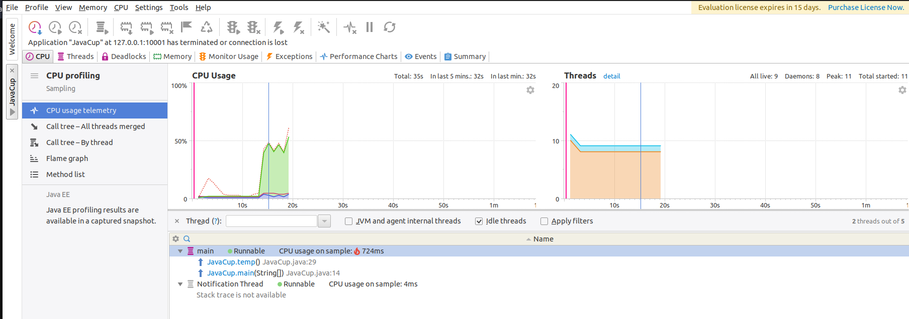
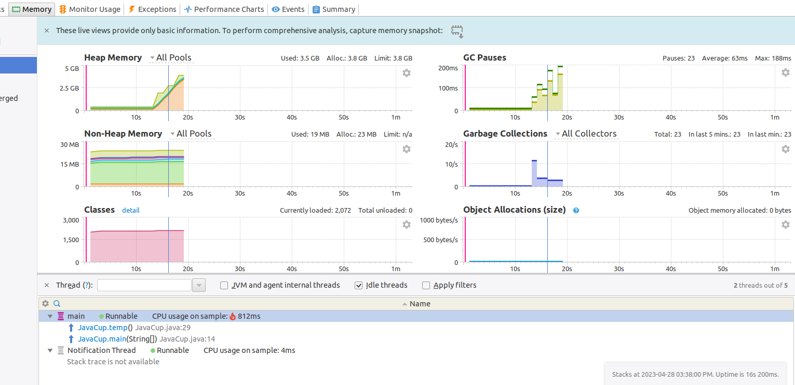
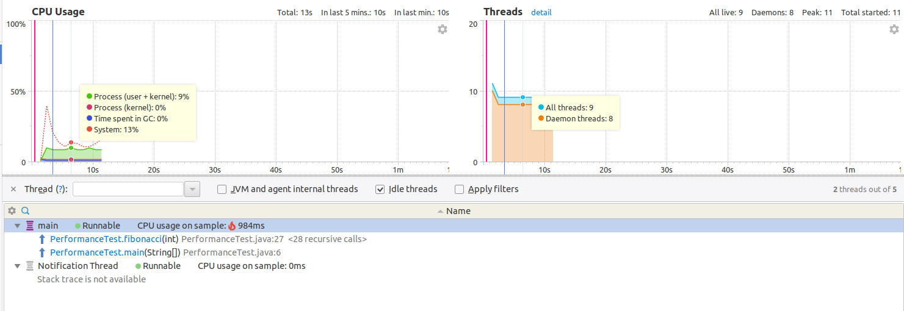
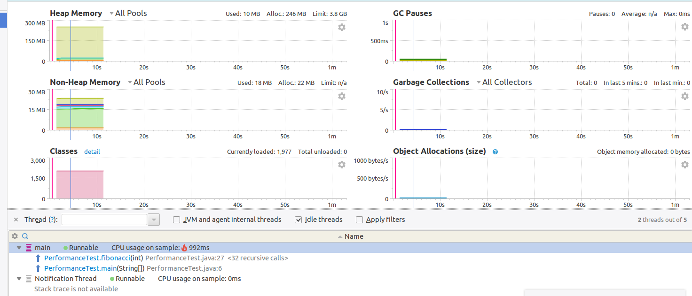
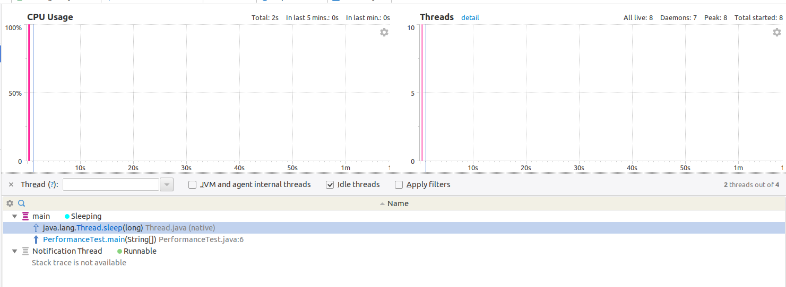

اجرای JavaCup.java:  

همانطور که در تصویر مشخص است، بعد از شروع اجرای تابع temp، میزان مصرف cpu و RAM بالا رفته است. 
  

برای تست ابزار yourkit، از کد PerformanceTest.java استفاده می‌کنیم. در این کد از پیاده‌سازی تابع فیبوناچی به دو صورت بازگشتی و برنامه‌نویسی پویا استفاده شده‌است. هدف اصلی کد، جمع اعداد فیبوناچی با یکدیگر و نمایش خروجی می‌باشد. ابتدا با حالت بازگشتی کد را اجرا می‌کنیم که خروجی به صورت زیر می‌باشد:  
(از آن‌جایی که سرعت اجرا با برنامه‌نویسی پویا بسیار بالا بود، در نمودارها چیزی دیده نمی‌شد. sleep ابتدای تابع اصلی برای ایجاد یک وقفه ایجاد شده است. در واقع هنگام اجرای تابع پیاده‌سازی شده با برنامه‌نویسی پویا یک اسلیپ قرار دادیم. به همین دلیل زمان اجرای این حالت زیاد شده است.)

اجرای تابع بازگشتی فیبوناچی:  
در این حالت جمع ۴۵ عدد اول دنباله را محاسبه کردیم.

اجرای فیبوناچی به صورت برنامه‌نویسی پویا:  
در این حالت جمع ۱۰۰۰ عدد اول را محاسبه کردیم تا مدت زمانی بیشتری طول بکشد :)

