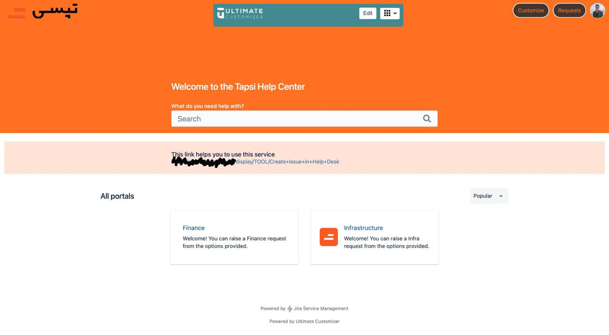
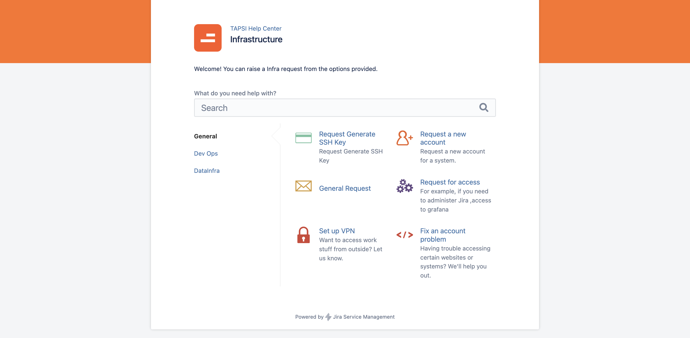
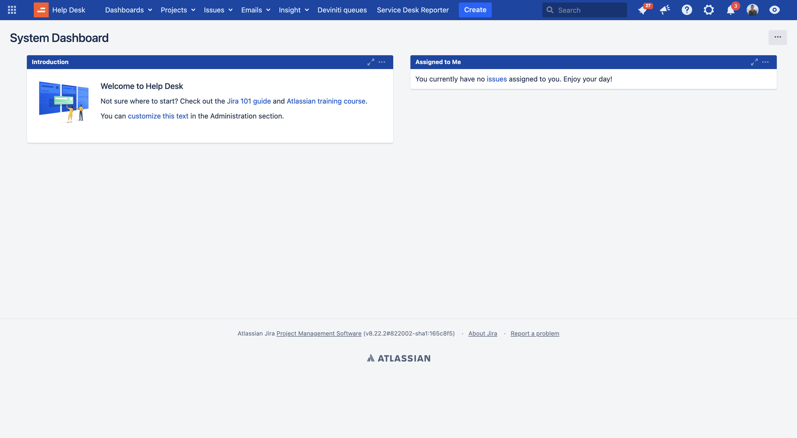
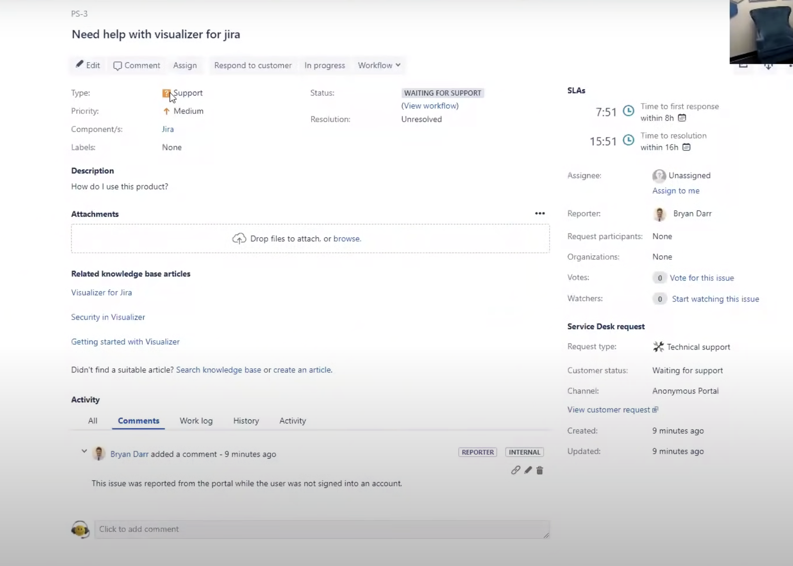
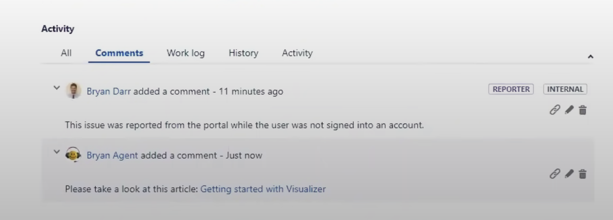
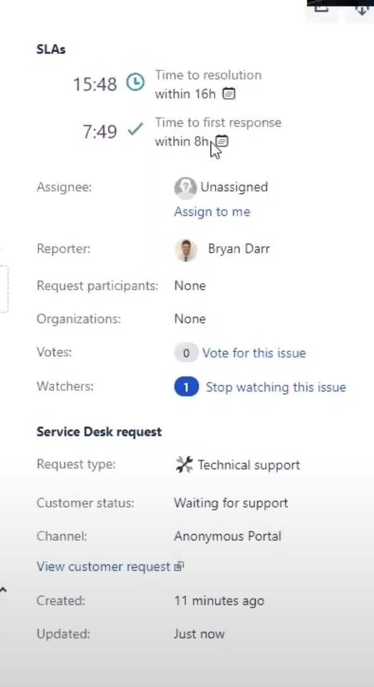

# Jira Service Desk

سرویس دسک جیرا یکی از ابزارهای IT service management (ITSM) هست که بر اساس چارچوب ITIL ساخته شده است. با استفاده از سرویس دسک جیرا، می‌توان مواردی نظیر insident management, problem management, change management, service request management و موارد دیگر را که همگی از موارد قابل توجه در فرایندهای ITIL هستند، پوشش داد.
  
## خلاصه
به طور کلی، سرویس دسک به این صورت است که در آن با تعریف فرایند‌ها و flowهای مختلف برای درخواست‌های متفاوت، امکان ارسال درخواست برای تیم سرویس‌دهنده فراهم می‌شود. به این صورت که در فلوی تعریف شده برای هر درخواست، فرمی تعریف می‌شود که در آن موارد مورد نیاز برای اجرای آن درخواست قرار می‌گیرد. شخص خدمت‌گیرنده، با پر کردن فرم مربوطه، به سرویس‌دهنده اطلاعات کافی در مورد درخواست خود را می‌دهد. از نکات مهم SLA که در درخواست نیز باید وارد شود، اهمیت اجرای درخواست و همچنین ددلاین آن است که در صورت گذر از ددلاین داده شده، SLA نقض می‌شود.

## بخش‌های مختلف
کاربران به عنوان درخواست‌کننده، ابتدا صفحه‌ای مانند صفحه‌ی زیر می‌بینند.

با انتخاب بخش مورد نظر، وارد صفحه‌ی فرم‌ها می‌شود.

در این قسمت، می‌تواند متناسب با درخواست خود، وارد فرم مشخص شده شود. بعد از پر کردن فرم، درخواست به سرویس‌دهنده می‌رسد.  
در سمت سرویس‌دهنده، پنل مجزایی وجود دارد. به این صورت که ابتدا درخواست‌ها Approve می‌شوند و سپس به یکی از اعضای تیم Assigne می‌شود. افراد می‌توانند در داشبورد خود، درخواست‌هایی که به آن‌ها اساین شده را ببینند.

در صفحه‌ی مخصوص هر درخواست،‌ مشروح درخواست کاربر، ددلاین و سایر موارد مربوط به SLA قابل مشاهده هستند. هر درخواست در صفحه‌ای مانند صفحه‌ی زیر قابل مشاهده است.

در پایین صفحه، امکان ارتباط با درخواست‌کننده از طریق کامنت نیز هست. همچنین، امکان نوشتن کامنت به صورت درون تیمی نیز وجود دارد (Internal). یعنی کامنتی که فقط سرویس‌دهندگان می‌بینند و کاربر درخواست دهنده امکان مشاهده‌ی آن را ندارد.

موارد مربوط به SLA، در سمت راست صفحه قابل مشاهده است. مواردی نظیر زمان، شخص موظف به اجرای درخواست و موارد مشابه.

