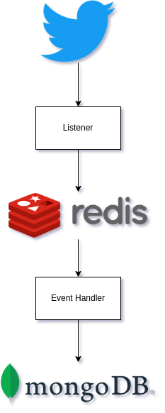

# Lab 9 - Microservice
### Software Engineering
- Ali Shirmohammadi 97106068
- Mohammad Hosein Bahmani 97105811


## How to setup

``` 
docker build -t mhbahmani/twtitter-likes:base -f Dockerfile-Base .
docker build -t mhbahmani/twtitter-likes:listener -t LISTENER .
docker build -t mhbahmani/twtitter-likes:handler -t HANDLER .
```
<div dir="rtl">

وظیفه‌ی این پروژه، دریافت درخواست‌های کاربران در توییتر و پیدا کردن بیشترین لایک‌کنندگان توییت‌های آن‌ها می‌باشد.

نحوه‌ی کار این پروژه به این گونه است که یک سرویس Listener، وظیفه‌ی خواندن دیتا از توییتر را برعهده دارد. این سرویس، داده‌های مورد نیاز را در یک Redis ذخیره می‌کند.
سرویس دیگری وجود دارد که ایونت‌ها را از صف Redis خوانده و اقدام متناسب با هر کدام را انجام می‌دهد.

داده‌هایی که از توییتر خوانده و وارد ردیس می‌شوند عبارت اند از:  
۱- نوع درخواست  
۲- نام کاربری درخواست کننده  
۳- user id  

سرویس handler با دریافت این داده‌ها از صف، با داشتن اطلاعات درخواست کننده، می‌تواند دیتای لازم را جمع‌آوری کرده و خروجی لازم را تولید کند.

در این دیاگرام، شمای کلی عملکرد پروژه و نحوه‌ی قرارگیری هر یک میکروسرویس‌ها قابل مشاهده است:


</div>